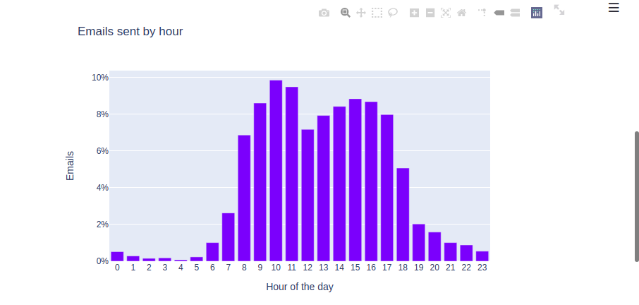
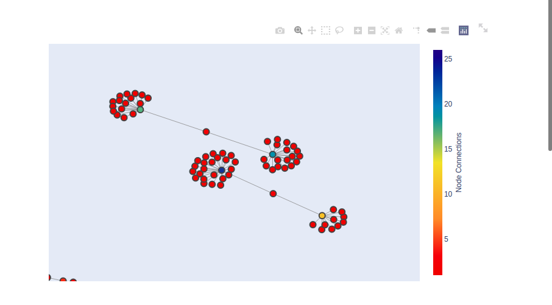

# Exploration of Enron-Emails dataset

https://enrondetective.herokuapp.com/

### Objective:

Data exploration of +500K emails to find describing insights of the company anditeration among its employees.

### Techniques used to explore data:

- **Natural Language Processing**

Applied for data cleaning as well as tokenization to extract main content.

- **Work in Pandas**

Helpful to find first insights and stats from the data. For example, looking at the email traffic was possible to identify working hours, holidays and hiring seasons.

- **Sentiment Analysis**

Specific departments among the conversations were selected in order to evaluate and compare email content, sentiments defined by the content and its variation according with the hour of work.

- **Network-analysis**

To visualy find the iterations between employees and identify "islands of information", botleneck in comunication and most relevant actors in the company.

### About the data 

[Enron-Email dataset](https://www.kaggle.com/wcukierski/enron-email-dataset)

The Enron email dataset contains approximately 500,000 emails generated by employees of the Enron Corporation. It was obtained by the Federal Energy Regulatory Commission during its investigation of Enron's collapse

Version of dataset: May 7th, 2015 , as published at (https://www.cs.cmu.edu/~./enron/)

### Results

Available at : (https://enrondetective.herokuapp.com/)

### Collaborators:

[Chirag Sharma](https://github.com/ChiragSharma8)
[Wim Christiaansen](https://github.com/WimChristiaansen)

